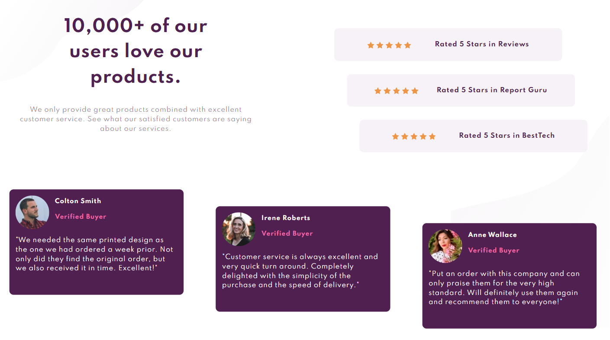
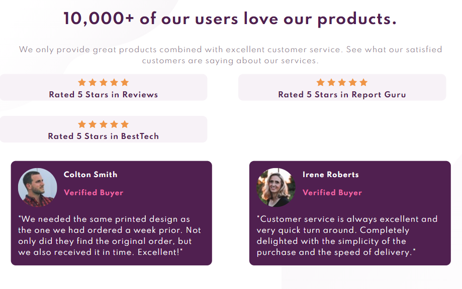
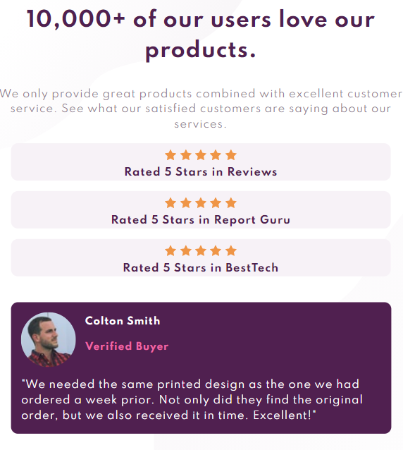

# user-review-page
Front-end Mentor Challenge #2

# Frontend Mentor - Order summary card solution

This is a solution to the [Social proof section on Frontend Mentor](https://www.frontendmentor.io/challenges/social-proof-section-6e0qTv_bA). Frontend Mentor challenges help you improve your coding skills by building realistic projects. 

## Table of contents

- [Overview](#overview)
  - [Screenshot](#screenshot)
- [My progress](#my-progress)
  - [Built with](#built-with)
- [Author](#author)

## Overview

The idea of the challenge was to take a completed UI design and recreate it with HTML and CSS as close as possible, to train front-end dev skills

### Screenshot

## My process

Was able to complete a fully responsive web page according to the UI design

### Built with

- Semantic HTML5 markup
- CSS custom properties
- Flexbox
- Grid
- Media Query

## Author

- Website - [Margarita Busygina](https://festive-meninsky-f42b8d.netlify.app/)

